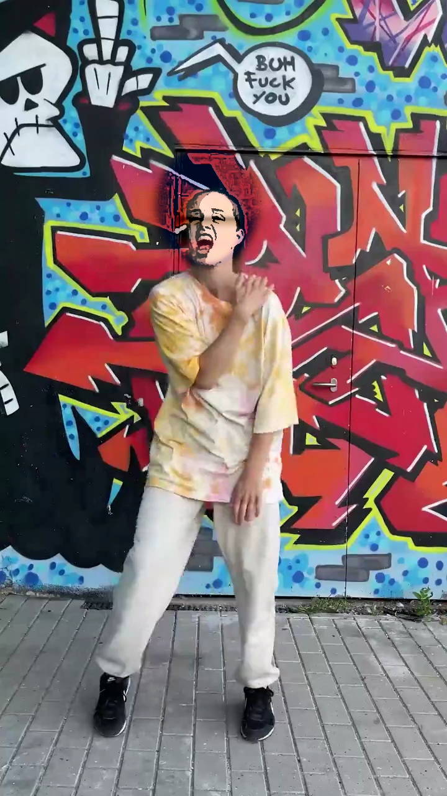
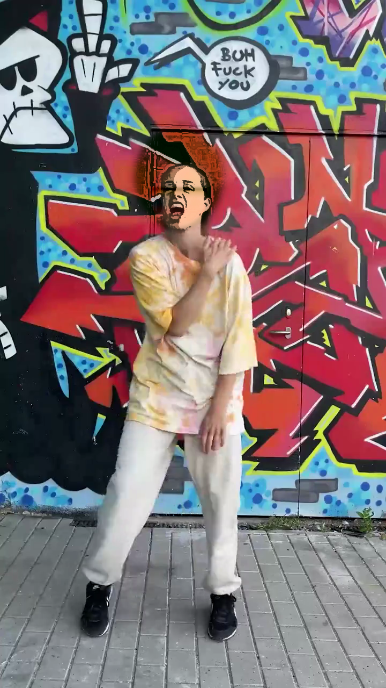
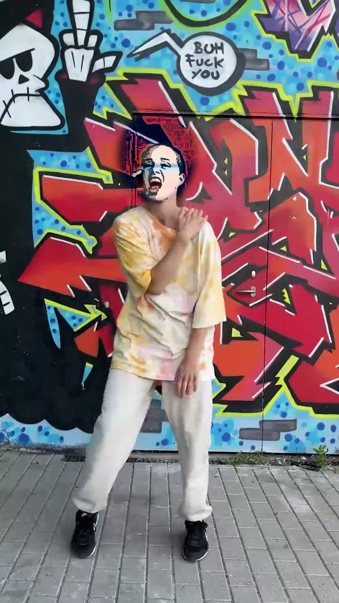
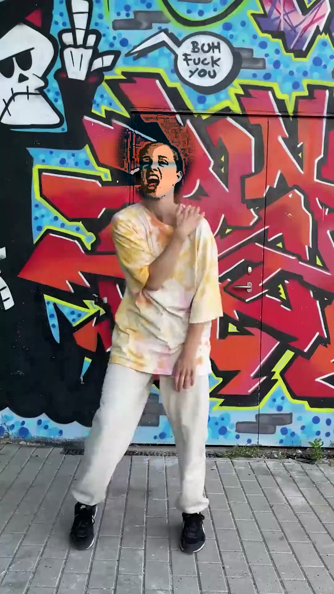
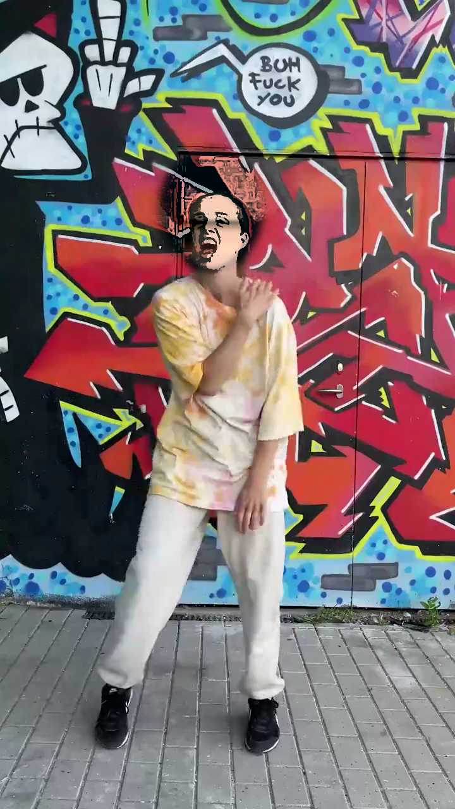

# Theme catalogue

Five hand-authored theme palettes for the AvatarShield pure-IVP501 pipeline
(`spec.md` §6, `plan.md` Phase 6). Each theme is a sub-1 KB JSON file —
no PNG avatar, no third-party model — that fully describes the target look
through Lab-space statistics plus four scalar style knobs.

The rendered previews below were produced by
`scripts/phase6_render_previews.py` on frame `#262` of
`samples/input/clip.mp4` (the frontal pick from Phase 1), using the
canonical Phase 5 strengths (`pre_skin=0.25`, `skin=0.55`,
`features=0.75`, `hair=0.55 chroma-only`).

---

## 1. JSON schema

```json
{
  "name":        "porcelain-pink",
  "description": "...",
  "skin_lab":    [L, a, b],
  "hair_lab":    [L, a, b],
  "lips_lab":    [L, a, b],
  "eyes_lab":    [L, a, b],
  "brows_lab":   [L, a, b],
  "saturation_boost": 1.30,
  "edge_strength":    0.85,
  "luminance_levels": 3,
  "chroma_levels":    0
}
```

- All Lab triples follow OpenCV's `cv2.COLOR_BGR2LAB` convention:
  `L ∈ [0, 255]`, `a` and `b` centred at `128` (`+a` ≈ red, `−a` ≈ green,
  `+b` ≈ yellow, `−b` ≈ blue).
- `hair_lab` is applied **chroma-only** — only `(a, b)` are used; the
  user's hair luminance is preserved so shading detail survives.
- `saturation_boost` / `edge_strength` / `luminance_levels` /
  `chroma_levels` override the matching `RenderConfig` defaults
  (`spec.md` §6.1).

`avatarshield.palette.load_theme(name)` reads and validates the JSON;
`avatarshield.palette.list_available_themes()` enumerates this folder.

---

## 2. Catalogue

| # | Theme | Style tag | Skin Lab | Hair Lab (chroma) | Eyes Lab | sat / edge / lum |
|---|-------|-----------|----------|-------------------|----------|------------------|
| 1 | [`porcelain-pink`](porcelain-pink.json) | High-key shoujo | `[220, 140, 144]` | `(148, 108)` magenta | `[ 85, 140, 152]` hazel | `1.30 / 0.85 / 3` |
| 2 | [`tan-amber`](tan-amber.json)           | Studio Ghibli mid | `[175, 142, 158]` | `(140, 160)` brown-amber | `[100, 138, 160]` honey | `1.15 / 0.75 / 3` |
| 3 | [`ivory-violet`](ivory-violet.json)     | Fantasy | `[230, 132, 134]` | `(148, 100)` violet | `[135, 124, 105]` pale blue | `1.35 / 0.95 / 3` |
| 4 | [`bronze-teal`](bronze-teal.json)       | Sporty | `[150, 148, 162]` | `(118, 118)` black-teal sheen | `[100, 112, 118]` teal | `1.25 / 0.90 / 3` |
| 5 | [`peach-noir`](peach-noir.json)         | Noir / monochromatic | `[200, 138, 146]` | `(128, 128)` inky black | `[ 55, 132, 142]` deep brown | `0.95 / 1.05 / 2` |

`peach-noir` is intentionally desaturated (`saturation_boost < 1.0`),
posterised to two luminance bands (`luminance_levels = 2`), and pushed
slightly past the default edge strength so the cel line reads as ink-on-paper.

---

## 3. Previews

Single-frame comparison (frame `#262`, original first):


Per-theme close-up:

| Theme | Preview |
|---|---|
| `porcelain-pink` |  |
| `tan-amber`      |  |
| `ivory-violet`   |  |
| `bronze-teal`    |  |
| `peach-noir`     |  |

---

## 4. Re-rendering the previews

```bash
.venv/bin/python scripts/phase6_render_previews.py
# optional flags
.venv/bin/python scripts/phase6_render_previews.py \
  --frame 262 \
  --video samples/input/clip.mp4
```

The script writes:

- `assets/themes/previews/<name>.png` — one per theme.
- `data/output/phase6_grid.png` — 2×3 grid (original + 5 themes).

---

## 5. Authoring a new theme

`spec.md` §6.2 describes the manual flow (load a reference image,
mask each region, compute mean Lab, preview, tune the four scalars,
save JSON). A future `notebooks/author_theme.ipynb` will host this
flow interactively; until then, hand-edit a new JSON in this folder
and re-run `phase6_render_previews.py` to verify.
