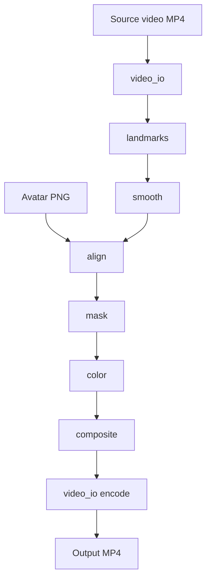

# AvatarShield — Kế hoạch triển khai (LEGACY)

> ⚠️ **LEGACY — superseded by `plan.md` on branch `ivp-pure`.**
> This plan tracks the previous pipeline (MediaPipe + avatar PNG warp + VToonify head-region stylization). It is kept for historical context only. Do not pick up tasks from this file.
> The active plan moves to a pure-IVP501 path — see `plan.md` and `spec.md`.

**Tham chiếu:** `spec_legacy.md` v0.5 · Khóa IVP501  
**Phạm vi:** Chỉ build **tính năng render video** — không app, server, hay job queue như Boogiz.

**Trạng thái hiện tại:** implementation cũ đã xóa; docs + `samples/input/` sẵn có; package `avatarshield/` chưa scaffold.

---

## 0. Tóm tắt

**Input:** video gốc (người quay) + ảnh avatar (PNG reference).  
**Output:** video mới — face region thay bằng avatar, giữ chuyển động / pose.

Boogiz chỉ tham chiếu **I/O**:

| Học từ Boogiz | Không làm |
|---------------|-----------|
| 2 input: video + ref image | Mobile app, upload, billing |
| Output video stylized | MongoDB, S3, push, job polling |
| External processor + prompts | Copy toàn bộ backend Boogiz |

**Deliverable:** module Python + CLI:

```bash
python -m avatarshield.render \
  --video samples/input/clip.mp4 \
  --avatar assets/avatars/01.png \
  --output data/output/clip_avatar.mp4
```

Trước khi có `assets/avatars/`, dùng tạm `samples/input/avatar.jpeg` cho Phase 1.

---

## 1. Boogiz (reference only)

API **arbedout**: `video_url`, `ref_img_url`, prompts, `workflow_name` → video stylized giữ movement. Processor không có trong repo Boogiz.

**Contract local:**

```python
def render_ai_video(
    video_path: str,
    avatar_path: str,
    output_path: str,
    *,
    config: RenderConfig | None = None,
) -> RenderResult:
    ...
```

---

## 2. Kiến trúc



**Package layout** (target — xem `spec.md` §5.2):

```
avatarshield/
├── render.py       # render_ai_video(), process_frame(), __main__ CLI
├── video_io.py
├── landmarks.py
├── smooth.py
├── align.py
├── mask.py
├── color.py
└── composite.py
```

| Lớp | Mô tả | MVP |
|-----|-------|-----|
| **A — Local IVP** | MediaPipe + warp + mask + color + blend | **Bắt buộc** |
| **B — External API** | Adapter Boogiz-style nếu có endpoint | Optional (`backend="external"`) |

---

## 3. Lộ trình theo phase

Thứ tự implement — không gắn deadline; tick khi xong.

### Phase 0 — Scaffold

- [x] Xóa implementation cũ, đồng bộ docs v0.5
- [x] `requirements.txt` (OpenCV, MediaPipe, NumPy, Pillow)
- [ ] `avatarshield/` package + `render.py` passthrough (copy video → MP4)
- [ ] `video_io.py` tối thiểu
- [ ] CLI: `python -m avatarshield.render ...` tạo MP4 (chưa có avatar)

---

### Phase 1 — Một frame (debug)

**Học:** S04 geometry, S06 mask, S07 color.

- [ ] `landmarks.py` — Face Landmarker; export JSON optional
- [ ] `align.py` — similarity transform (2 mắt + mũi)
- [ ] `mask.py` — face oval + Gaussian feather
- [ ] `color.py` — histogram / mean match vùng da
- [ ] `composite.py` — alpha blend (+ optional Poisson)
- [ ] Flag `--frame-index N` → PNG debug

**Artifacts:** `data/output/frame_before.png`, `frame_after.png`, `landmarks.json`

**Sample:** `samples/input/clip.mp4` frame 0 + `samples/input/avatar.jpeg`

---

### Phase 2 — Video loop

- [ ] `render.py` — `process_frame()` trong vòng lặp → encode
- [ ] Progress log (frame i/total)
- [ ] Clip ngắn → MP4 có avatar (chưa smooth)

---

### Phase 3 — Temporal smoothing

**Học:** S09–S10.

- [ ] `smooth.py` — One Euro hoặc Kalman (mắt, mũi, cằm)
- [ ] Smooth **trước** align, không sau composite
- [ ] So sánh side-by-side có/không smooth

---

### Phase 4 — Assets & polish

- [ ] 5 PNG trong `assets/avatars/` (VRoid export, neutral pose)
- [ ] Tune `feather_px`, `color_match_strength` (`RenderConfig`)
- [ ] Stretch: blendshape-driven warp nhẹ

---

### Phase 4.5 — Stylization stretch (out-of-band, implemented)

Track song song — script độc lập (không gắn vào avatar-PNG pipeline):

- [x] AnimeGANv2 paprika whole-frame — `scripts/animegan_render_video.py`
- [x] Combo AnimeGAN + VToonify pixar face (per-frame tracking + EMA + temporal
      blend) — `scripts/combo_render_video.py`
- [x] Post-process h264 + side-by-side compare — `scripts/post_animegan.sh`

DCT-Net (modelscope) đã thử và loại — TF CPU-only quá chậm trên Apple Silicon.
Pivot từ AnimeGAN whole-frame (paprika) sang VToonify head-region (face+hair via
BiSeNet parsing mask) vì combo AnimeGAN+VToonify quá chậm trên M1 (~20 min /
clip 720p) mà gain anonymization không tương xứng — head region đã giữ toàn bộ
identity signal cần che. Defaults hiện tại: cartoon s26 d1.0, parsing mask,
color_match 0.4, temporal_blend 0.25.

---

### Phase 4.6 — Stylization wired into API + Expo app (implemented)

Promoted from out-of-band script to a first-class user feature.

- [x] `avatarshield/stylize.py` — `StylizeConfig`, `render_stylized_preview()`,
      `render_stylized_video()`. Module-level model cache (shared BiSeNet +
      pSp + dlib; VToonify generator per preset).
- [x] API endpoints in `api/server.py`:
  - `GET  /stylize/presets`
  - `POST /stylize/preview`
  - `POST /stylize/preview/{job_id}/reroll`
  - `POST /stylize/render/{job_id}` (async, in-memory job registry)
  - `GET  /stylize/render/{job_id}/status`
- [x] Merged venv (`.vtoonify_venv` gains fastapi + multipart + mediapipe;
      `.venv` deprecated for the API).
- [x] Expo (`app/`): "Anime stylize" filter set as the primary editor option.
      Base-style chips × 5 + intensity pill × 3 (Light/Medium/Strong →
      style_degree 0.5/0.8/1.0). Async commit with progress bar + ETA.
      Avatar-PNG path retained as the secondary "Avatar swap" filter.
- [ ] Per-preset `style_id` sweep — currently `style_id=26` for all 5
      presets (placeholder, baseline cartoon s26 is the reference).
- [ ] Web client (`web/`) — intentionally not wired in this phase.
      Endpoint surface is ready when needed.

---

### Phase 5 — Evaluation & báo cáo

| Axis | Metric |
|------|--------|
| Privacy | Re-id ↓ (FaceNet/ArcFace sample frames) |
| Utility | Pose / landmark jitter |
| Baseline | Gaussian blur (S05) |

- [ ] `notebooks/eval_*.ipynb`
- [ ] Report, slides, pre-record demo clip
- [ ] `ETHICS.md`, `RESULTS.md`

Demo course: CLI hoặc notebook — Gradio optional.

---

## 4. Public API (target)

```python
# avatarshield/render.py

@dataclass
class RenderConfig:
    feather_px: int = 15
    color_match_strength: float = 0.6
    smooth: bool = True
    backend: Literal["local", "external"] = "local"

@dataclass
class RenderResult:
    output_path: str
    frame_count: int
    fps: float
    duration_s: float

def render_ai_video(
    video_path: str | Path,
    avatar_path: str | Path,
    output_path: str | Path,
    config: RenderConfig | None = None,
) -> RenderResult: ...

def process_frame(
    frame_bgr: np.ndarray,
    avatar_bgr: np.ndarray,
    landmarks: LandmarkResult,
    config: RenderConfig,
) -> np.ndarray: ...
```

`process_frame` tách riêng cho Phase 1 tests và notebooks.

---

## 5. Phân công nhóm (3 người)

| Vai trò | Trách nhiệm |
|---------|-------------|
| **A — Pipeline** | Phase 0–3: landmarks → composite → video |
| **B — Assets & tuning** | VRoid PNG, mask/color params, QA |
| **C — Eval & docs** | Notebooks, metrics, report, demo video |

**Sync points:** sau Phase 1 (1 frame ổn) → Phase 2 (clip ngắn) → Phase 5 (eval).

---

## 6. Quyết định mở

| # | Câu hỏi | Gợi ý |
|---|---------|-------|
| D1 | Avatar runtime format? | **PNG + warp** (đã chốt) |
| D2 | External API như Boogiz? | Chỉ nếu có endpoint; else `backend="local"` |
| D3 | Expression từ blendshape? | Stretch sau Phase 3 |
| D4 | Gradio? | Optional; CLI + notebook đủ |

---

## 7. Definition of Done

- [ ] `render_ai_video(video, avatar) → output.mp4` trên sample local
- [ ] Debug từng bước trên 1 frame (PNG artifacts)
- [ ] Smoothing giảm jitter vs không smooth
- [ ] Eval: privacy + 1 utility metric + blur baseline
- [ ] Report + slides + demo video pre-recorded

---

## 8. Next actions

1. Chốt D2 (local-only vs external adapter).
2. Phase 0: scaffold `avatarshield/` + passthrough CLI.
3. Phase 1: một frame với `clip.mp4` + `avatar.jpeg`.
