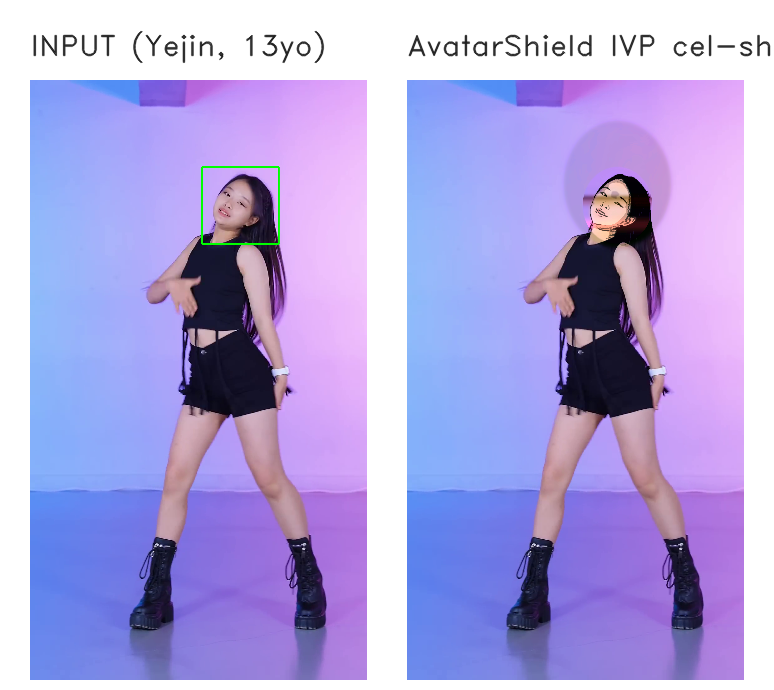
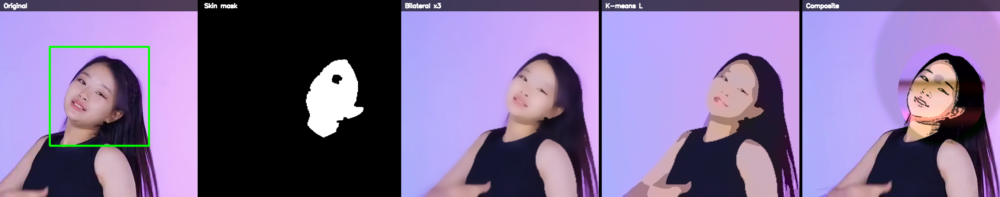
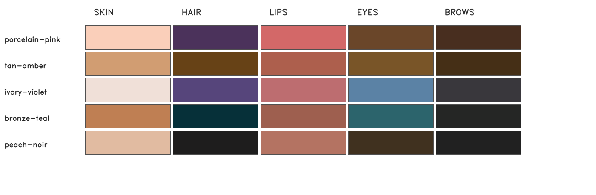
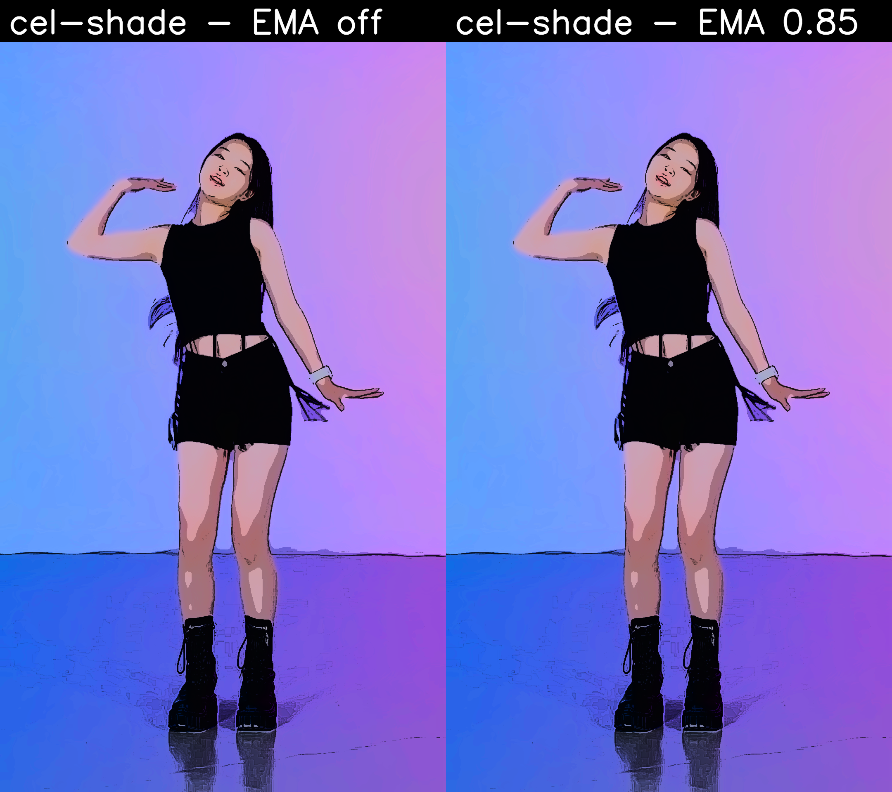
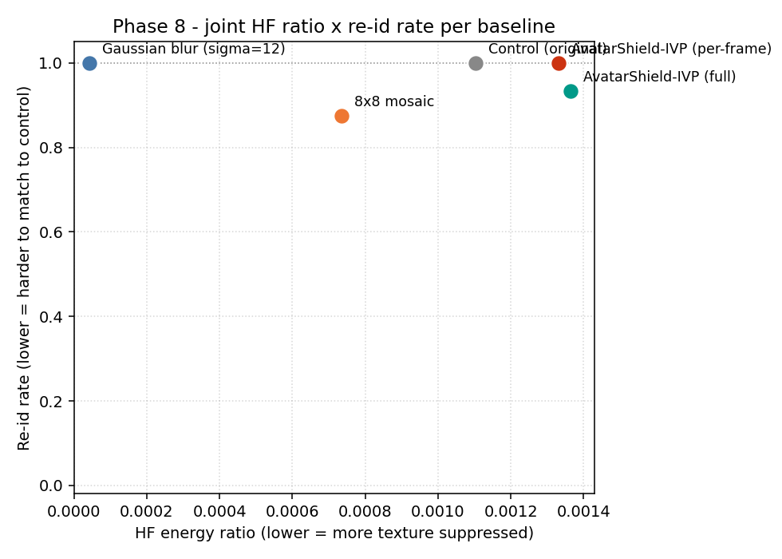

# Why Pure-Classical IVP?

## Neural approaches fall short

- **GAN stylization** — polished but *inexplicable*
- **Full-face replacement** — loses *agency*
- **AR filters** — cosmetic, not formal
- **Black-box** — every pixel un-defendable

## Pure-classical advantages

- **OpenCV + NumPy + Pillow** — 0 neural
- **CPU-only** ~2.7 fps on M1
- **Fully explainable** per pixel
- **Identity reborn** from theme + self-recognition cues

Same frame · cel-shade core + porcelain-pink palette

---

# Pipeline Overview

| Stage | Module |
|---|---|
| Detect | Haar cascade (frontal + profile) |
| Skin mask | HSV ∩ YCbCr + morphology + connected components |
| Cel-shade core | Bilateral × 3 → Lab K-means → XDoG → HSV lift |
| Recolor | Reinhard transfer in Lab, **per region** (hair chroma-only) |
| Stabilize | One Euro on bbox + EMA α=0.85 on K-means centers |
| Composite | Alpha blend ellipse onto original frame |

---

# 5 Theme Palettes × Per-Region Reinhard

**Palette structure** — 5 Lab triples (skin · lips · eyes · brows · hair) + 4 style scalars (luminance levels · edge strength · saturation boost · chroma levels) per theme. Reinhard transfer in **Lab space, per region**.

**Hair: chroma-only** — preserves user's L → self-recognition cue intact. Subject sees a *stylized themselves*, not a stranger; strangers see a scrambled identity.

---

# Temporal Stability — One Euro + EMA

EMA off (left) vs EMA α=0.85 (right) — same source, no boiling

## Two anti-flicker mechanisms

- **One Euro filter** on bbox `(cx, cy, w, h)` — adaptive low-pass, hold-last-good ≤ 6 frames
- **EMA α=0.85** on the 3 Lab K-means cluster centers — posterize bands locked across frames

## Ablation (head-region MAD, n=667 frames)

| Baseline | MAD |
|---|:---:|
| Control | 8.29 ± 3.57 |
| IVP **OFF** | 20.17 ± 10.25 |
| IVP **ON** | **17.66 ± 7.48** |

→ Excess MAD drops **~30 %**, std **halved**

---

# Privacy — FaceNet Re-ID + Detector Survivability

Same frame · control · blur σ=12 · 8×8 mosaic · IVP no-smooth · IVP full

FaceNet (vggface2), cos d > 0.7, every 15th frame, n=33 on <code>clip.mp4</code>

| Baseline | n (paired) | mean dist | re-id rate |
|---|:---:|:---:|:---:|
| Gaussian blur σ=12      |  5 | 0.596 | 0.800 |
| 8×8 mosaic              | 17 | 0.526 | 0.941 |
| **AvatarShield IVP**    | 24 | 0.673 | **0.667** |

- **IVP: lowest re-id (0.667) AND highest detector survivability (24/33)**
- Blur "wins" re-id only because detector dies (5/33) — false win
- IVP keeps head locate-able *and* pushes re-id below blur and mosaic

---

# Joint Trade-Off — FFT HF Ratio × Re-ID Rate

## Reading the scatter

- **Blur** — top-left: maximum texture suppression, but detector dies
- **Mosaic** — middle: blocks both axes moderately
- **Control / IVP** — top-right: XDoG line art **is** HF signal by design

## Why re-id is the headline

- HF ratio alone rewards blur unfairly
- Re-id with detector-survivability count tells the honest story
- IVP wins the joint trade-off without faking either axis

---

# Limitations & Non-Claims

## What this does NOT claim

- **n=1 source clip** for headline numbers (dancing clip fails when face < 5 % of frame height — Haar limit)
- **Single embedder** — FaceNet vggface2 only; ArcFace deferred
- **No human study** — self-recognition Studies A/B deferred
- **Threat model** — defends *casual* face matching only

## Out of scope

- Motivated attacker with reference photo
- Re-identification by people who already know the subject
- Real-time / on-device deployment (2.7 fps CPU)
- Production privacy guarantee (research prototype)

AvatarShield ≠ K-anonymity guarantee. It is <b>visual-story-preserving anonymization</b> for child-safe social sharing, defended by transparent classical IVP operators — not by black-box trust.

